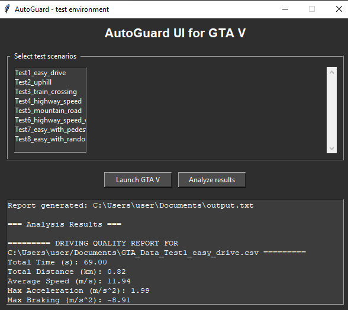
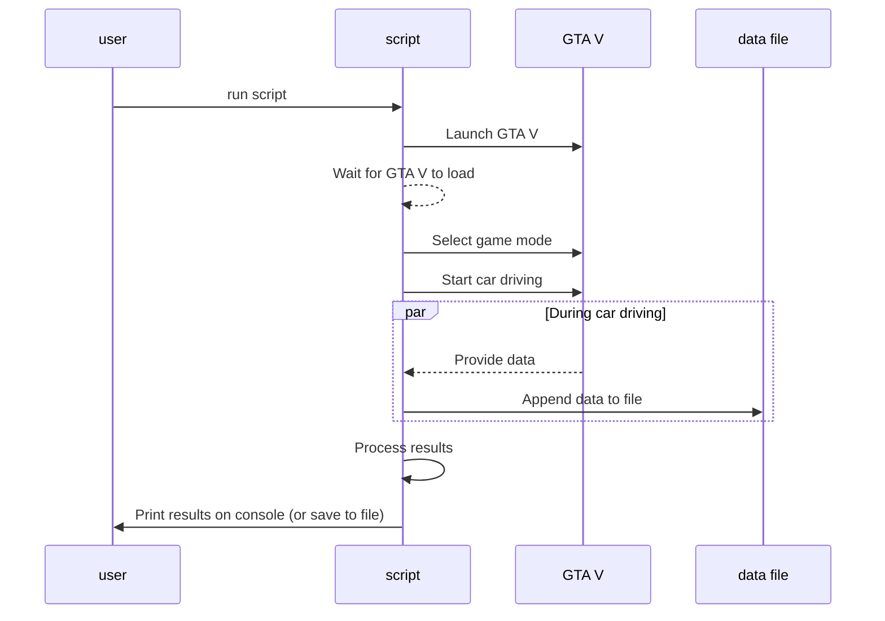

# AutoGuard
Implementation of autonomous self driving test environment using GTA V for future autonomous driving security and functional safety tests.

Additionally, this project includes a Python script that automatically launches GTA V with the mod to run test scenarios and collect driving data, as well as a post-processing script that analyzes the recorded metrics (e.g., speed, collisions) and generates report.

I am currently using the [seamless autonomous driving mod](https://www.gta5-mods.com/scripts/seamless-autonomous-driving-mod-no-keys-menus-or-buttons) to test autonomous driving in GTA V. However, for effective testing, it is essential to have a component that can interact with the graphical interface of GTA V, providing inputs and monitoring outputs dynamically.

## Getting Started

### Requirements:
 - python 3.13
 - `pip install -r requirements.txt`

### Prerequisites
1. **GTA V** installed and 1280x720 screen resolution for the game
2. **.NET Framework** for running the C# mod
3. Dependencies:
   - Rockstar Games Launcher (and be already logged in)

### Running
1. clone repo
2. testing stage: run `python env/app.py` to open game and run test suite
3. analyzing stage: run `python processing/main.py > output.txt` to generate raport from testing stage

### GUI alternative:
1. clone repo
2. run `python ui.py`

### How it works
- `env` - python script to load mods, saves and run game
- `mod` - C# gtav mod to set target points on map, find the nearest car to drive and start driving to enable `seamless autonomous driving mod`  
https://www.gta5-mods.com/scripts/seamless-autonomous-driving-mod-no-keys-menus-or-buttons
- `processing` - python script to analyzing data from test videos

### Basic flow  

### Driving metrics

Below is a brief explanation of each metric gathered and recorded by the **DrivingMetricsCollector**. These metrics are logged to a CSV file for post-processing and analysis.

| **Metric**              | **Description**  |
|-------------------------|--------------------------------------------------------------------------------------------------------------------------------------------------------------------------------------------------------------------------------------------------------------------------------------------------|
| **Time**               | Timestamp (date and time)|
| **PositionX/Y/Z**      | The vehicle's coordinates in the GTA V world space at the time of recording|
| **Speed**              | The current speed of the vehicle in meters per second (m/s)|
| **SpeedDeviation**     | The absolute difference between the vehicle's current speed and the zone-based speed limit. Speed limits depend on the recognized area (e.g., highway/city/other)|
| **Jerk**               | The rate of change of acceleration (m/s³). Computed by comparing the difference in speed (m/s) between consecutive samples over the time between samples. High jerk values may indicate aggressive or jerky driving maneuvers|
| **SteeringAngle**      | The current steering angle of the vehicle's wheels (in degrees) at the time of recording. Positive or negative values indicate turning direction|
| **LaneOffset**         | A measure (in meters) of how far the vehicle is from the center of its lane. A high offset might suggest drifting or lane departure|
| **LaneDepartures**     | Cumulative count of lane departures. Each time the vehicle's *LaneOffset* exceeds a threshold (e.g., 1.5 m) from the lane center, this count increments|
| **TrafficViolations**  | Cumulative count of traffic violations (e.g., running a red light, ignoring a stop sign)|
| **CollisionDetected**  | Boolean (`True`/`False`) indicating whether the vehicle collided with any object since the last check|
---

### todo shortterm
1. check if every metric has sense

### More informations
[more docs](https://docs.google.com/document/d/1IKcRw_cjcgbgFVxM3nnlapJooMkW_Ll9Ibul6B54esw)
