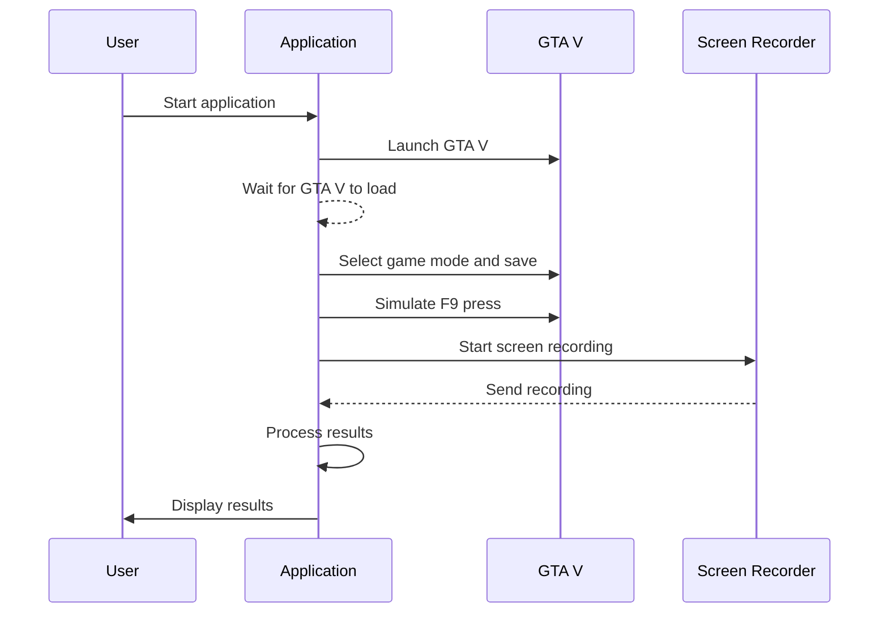

# AutoGuard
Implementation of autonomous self driving test environment using GTA V for future autonomous driving security and functional safety tests.

I am currently using the [seamless autonomous driving mod](https://www.gta5-mods.com/scripts/seamless-autonomous-driving-mod-no-keys-menus-or-buttons) to test autonomous driving in GTA V. However, for effective testing, it is essential to have a component that can interact with the graphical interface of GTA V, providing inputs and monitoring outputs dynamically.

## Getting Started

### Requirements:
 - python 3.13
 - `pip install -r requirements.txt`

### Prerequisites
1. **GTA V** installed and 1280x720 screen resolution for the game
2. **.NET Framework** for running the C# mod
3. Dependencies:
   - Rockstar Games Launcher (and be already logged in)

### Running
run `python env/app.py`

### How it works
- `env` - python script to load mods, saves and run game
- `mod` - C# gtav mod to set target points on map, find the nearest car to drive and start driving to enable `seamless autonomous driving mod`  
https://www.gta5-mods.com/scripts/seamless-autonomous-driving-mod-no-keys-menus-or-buttons
- `processing` - python scripts to analyzing data from test videos  

### Basic flow  

### More informations
[more docs](https://docs.google.com/document/d/1IKcRw_cjcgbgFVxM3nnlapJooMkW_Ll9Ibul6B54esw)
