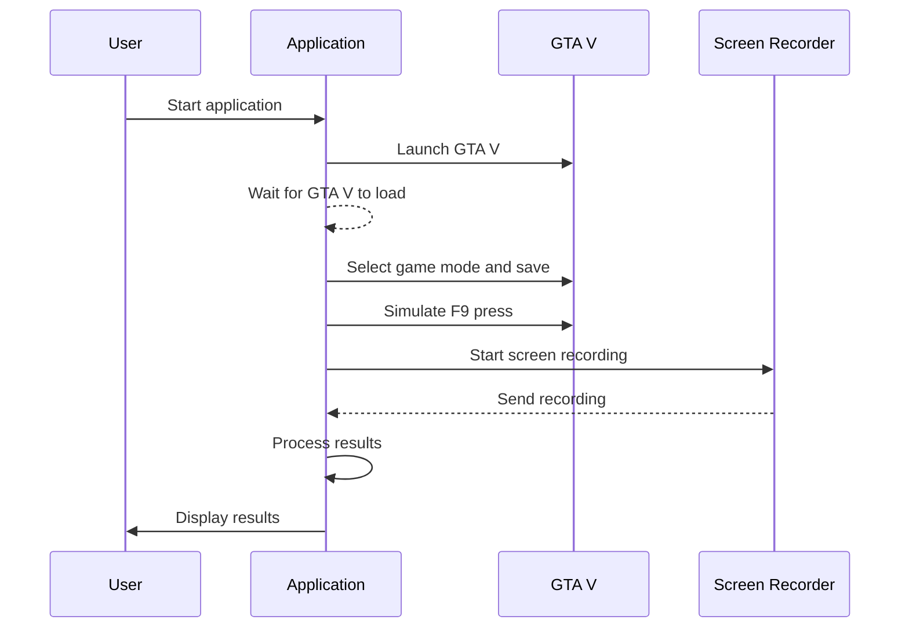

# AutoGuard
Implementation of autonomous self driving test environment using GTA V for future autonomous driving security and functional safety tests.

## Getting Started

### Requirements:
 - python 3.13
 - `pip install -r requirements.txt`

### Prerequisites
1. **GTA V** installed (via Epic Games or Steam).
2. **.NET Framework** for running the C# autonomous driving mod.
3. Dependencies:
   - Rockstar Games Launcher

### Running
run `python env/app.py`

### How it work

[more docs](https://docs.google.com/document/d/1IKcRw_cjcgbgFVxM3nnlapJooMkW_Ll9Ibul6B54esw)
